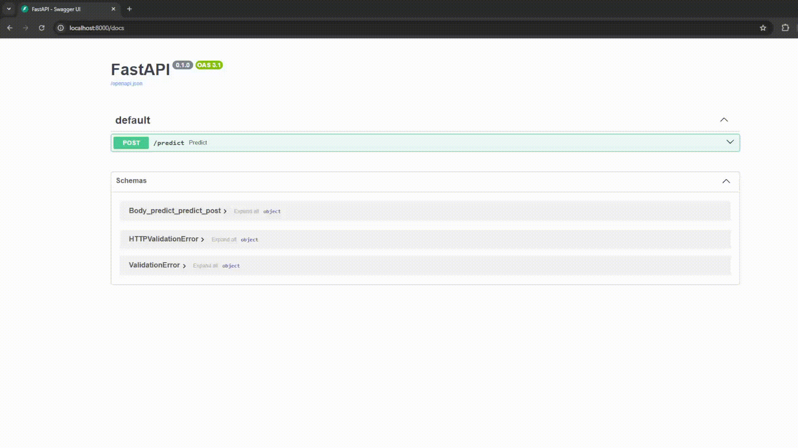

# 🐱🐶 Cat vs Dog Classifier — Deployment (M2 Extension)

## 📌 Overview

This project extends the ML model by adding a deployment layer using FastAPI and Docker.
It allows real-time image classification via an API.

---

## 🚀 How to Run (Docker)

### 1. Build the Docker image

```bash
docker build -t catdog-api .
```

### 2. Run the container

```bash
docker run -p 8000:8000 catdog-api
```

### 3. Open API docs

Go to:

```
http://localhost:8000/docs
```

---

## 🧪 Test Prediction

1. Open `/docs`
2. Use `/predict` and click Try it out
3. Upload an image
4. Click Execute to Get prediction (cat or dog)

---


## ⚙️ Tech Stack

* PyTorch (model)
* FastAPI (API layer)
* Docker (containerization)

---


## ⏱️ Notes

* First Docker build may take several minutes due to dependency installation.
* Subsequent builds are faster thanks to caching.

---

## 📁 Structure

```
ROOT
├── model.py
├── api.py
├── best_model.pt
├── requirements.txt
├── Dockerfile       
├── assets/recorded_prediction.gif 
```

---

## ✅ This project includes a deployment-oriented component using:

* FastAPI endpoint
* Docker containerization
## ⚠️ Note: The model may still produce some mispredictions.